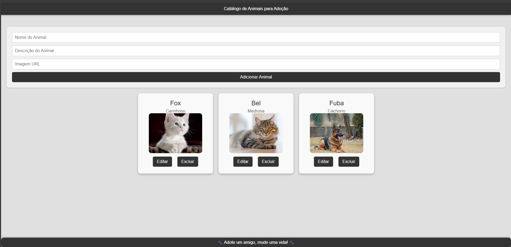

# pet-catalog

Este projeto é um catálogo interativo de animais disponíveis para adoção. Os usuários podem visualizar informações sobre os animais, editar detalhes e removê-los da lista. O projeto utiliza React e JSON Server para simular uma API.

## Tecnologias Usadas
* React: Biblioteca JavaScript para construção de interfaces de usuário.
* JSON Server: Ferramenta para criar uma API RESTful com um arquivo JSON.
* CSS: Estilização visual do projeto.

## Funcionalidades

* Visualizar uma lista de animais disponíveis para adoção.
* Adicionar novos animais ao catálogo.
* Editar informações de animais existentes.
* Remover animais do catálogo.
* Imagens padronizadas para cada animal.
* Botões de ação fixos para edição e remoção de itens.
